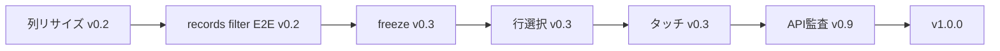

# ロードマップ（〜 v1.0.0）

[English](./roadmap.md)

Wasabi Table を **v1.0.0（公開 API 安定版）** まで導く計画書です。

- **方針・語り方**: [positioning.ja.md](./positioning.ja.md)
- **実装の分担**: [architecture.ja.md](./architecture.ja.md)
- **API の約束**: [api-stability.ja.md](./api-stability.ja.md)

**スケジュール**: 日付は置かず **フェーズと出口基準** で管理します。

---

## 1. 北極星（North Star）

> **Canvas + Rust/WASM で、npm 数行から始められる Excel 風データグリッド。  
> SaaS 管理画面のマスタ一覧/編集に載せられ、必要なら大規模 records まで同じ API で深掘りできる。**

v1.0.0 は「全機能完成」ではなく **「公開 API を約束できる品質」** のリリースです。

---

## 2. 確定方針（2026-06 時点）

| ID | 決定 |
|----|------|
| **P-01** | **Primary persona = SaaS 管理画面**（マスタ一覧・セル編集・列定義） |
| **P-02** | v1.0 Must UX = **列リサイズ / freeze / 行選択 / タッチ基本 / records filter・sort E2E** |
| **P-03** | 競合名比較表は README に載せない（[positioning](./positioning.ja.md)） |
| **P-04** | 数式・ピボットは 1.0 スコープ外 |
| **P-05** | React 公式パッケージは 1.0 時点 **docs + サンプルのみ** |
| **P-06** | npm バージョンを正とし、リリース時 `Cargo.toml` を同期 |
| **P-07** | 目標日は設定しない — **Release Train の出口基準** で進める |

---

## 3. 現状ベースライン（v1.0.0 実装完了・未リリース）

### v0.1.4 から引き継いだ基盤 ✅

| 領域 | 内容 |
|------|------|
| コア | Canvas + WASM、編集、選択、範囲、クリップボード、undo/redo |
| 列 | 列ヘッダー、フィールド型、バリデーション |
| データ | スパース + **records**（viewport 同期、100万行ベンチ） |
| UX | filter/sort（スパース）、条件付き書式、テーマ、リスナー API |
| 品質 | Vitest / cargo / Playwright / CI |
| docs | 日英、ベンチページ、プロダクト方針一式 |

### v0.2.0 〜 v1.0.0 で追加 ✅

| Must | 状態 |
|------|------|
| 列リサイズ | ✅ `setColumnWidth` / ヘッダー drag |
| freeze 列 | ✅ `freeze_cols`（行固定は schema のみ） |
| 行選択 | ✅ 行ヘッダー + Shift 拡張 |
| タッチ基本 | ✅ touch → mouse 転送 |
| records filter/sort E2E | ✅ `e2e/records-filter.spec.ts` |
| README Tier / ベンチ要約 | ✅ |
| Cargo / npm 同期 | ✅ 1.0.0 |
| API 監査・migration doc | ✅ v0.9.0 相当 |

---

## 4. v1.0 機能優先度（MoSCoW）

### Must — v1.0 リリース条件

**品質・API**

| ID | 項目 |
|----|------|
| M-A1 | 公開 API 監査 + semver 1.0 宣言 |
| M-A2 | Tier 1〜3 docs / 使用例（日英） |
| M-A3 | `npm run test:all` CI グリーン |
| M-A4 | 100万行ベンチ再現（benchmark.html） |
| M-A5 | スコープ外 README 明示 |
| M-A6 | Cargo / npm バージョン同期 |

**UX（P-02 確定）**

| ID | 項目 | 主なリリース |
|----|------|--------------|
| M-U1 | 列リサイズ（ヘッダー drag） | **v0.2.0** |
| M-U2 | records + filter/sort E2E | **v0.2.0** |
| M-U3 | 固定行/列（freeze） | **v0.3.0** |
| M-U4 | 行選択（Shift 拡張等） | **v0.3.0** |
| M-U5 | タッチ基本（スクロール・タップ選択） | **v0.3.0** |

**対外**

| ID | 項目 | 主なリリース |
|----|------|--------------|
| M-D1 | README Tier 1/2/3 動線 | v0.2.0 |
| M-D2 | ベンチマーク要約 + リンク | v0.2.0 |

### Should — 1.0 に入れたい（Must 未達なら延期可だが CHANGELOG に記載）

| ID | 項目 |
|----|------|
| S1 | バンドルサイズ README 記載 |
| S2 | Safari / Firefox 手動確認メモ |
| S3 | CSV export API 明文化 |

### Could — 1.0 後

列 drag reorder、CSV import、a11y 強化、`@wasabi-table/react`

### Won't — 1.0

数式、ピボット、セル結合、共同編集、SSR、Node 専用 — [positioning](./positioning.ja.md)

---

## 5. リリース列車

```
v0.1.4 ──► v0.2.0 ──► v0.2.x ──► v0.3.0 ──► v0.9.0 ──► v1.0.0
 今       SaaS向け第一弾    polish    UX Must完     API凍結    安定版
```

### v0.2.0 — SaaS 向け第一弾

**テーマ**: 管理画面で「触って信頼できる」状態 + 大規模 data story

| 区分 | 項目 | Must ID |
|------|------|---------|
| feat | 列リサイズ | M-U1 |
| test | records filter/sort E2E | M-U2 |
| docs | README Tier 動線 | M-D1 |
| docs | ベンチ要約 | M-D2 |
| docs | Product & direction 完備 | — |
| chore | Cargo.toml バージョン同期 | M-A6 |

**出口基準**

- [x] M-U1, M-U2, M-D1, M-D2 完了
- [x] デモで列幅変更 + records フィルター操作を確認

**想定 Issue ラベル**: `roadmap:0.2` `persona:saas-admin`

---

### v0.2.x — polish

- records / filter / 列幅のバグ修正
- ベンチ計測のブレ低減
- SaaS 管理画面向け usage 例の追加（任意）

---

### v0.3.0 — UX Must 完遂

**テーマ**: SaaS 管理画面の本番 UX（スクロール・選択・モバイル）

| 区分 | 項目 | Must ID |
|------|------|---------|
| feat | freeze 行/列 | M-U3 |
| feat | 行選択 | M-U4 |
| feat | タッチ基本 | M-U5 |
| docs | browser-support 更新（タッチ記載） | — |
| test | freeze / 行選択 / タッチの E2E | — |

**出口基準**

- [x] M-U3, M-U4, M-U5 完了
- [x] 上記 UX が E2E または docs 手順で再現可能

---

### v0.9.0 — API 凍結

**テーマ**: 1.0 前の最後の整理

| 区分 | 項目 | Must ID |
|------|------|---------|
| api | 公開 API 監査 | M-A1 |
| api | 破壊的変更があれば **ここで1回** | — |
| docs | migration-1.0（必要時） | — |
| qa | [security](./security.ja.md) チェック | — |
| test | Tier 1/2/3 代表 E2E 一式 | M-A3 |

**出口基準**

- [x] `dist/index.d.ts` ≡ api-core docs
- [x] CHANGELOG に 0.x → 1.0 移行要点

---

### v1.0.0 — 安定版

**テーマ**: semver 宣言 — **§6 全 Must ✅**

GitHub Release + npm `1.0.0` + README 最終化（choosing-a-grid / browser-support リンク）

---

## 6. v1.0.0 リリースチェックリスト

### Must UX（P-02）

- [x] M-U1 列リサイズ
- [x] M-U2 records filter/sort E2E
- [x] M-U3 freeze
- [x] M-U4 行選択
- [x] M-U5 タッチ基本

### Must 品質・API

- [x] M-A1 公開 API 監査 + semver 1.0 宣言
- [x] M-A2 Tier 1〜3 docs / 使用例（日英）
- [x] M-A3 `npm run test:all` CI グリーン
- [x] M-A4 100万行ベンチ再現（benchmark.html）
- [x] M-A5 スコープ外 README 明示
- [x] M-A6 Cargo / npm バージョン同期

### Must 対外

- [x] M-D1, M-D2

### Should（延期時は README に明記）

- [x] S1 バンドルサイズ（README 目安記載）
- [ ] S2 Safari/Firefox 手動確認（browser-support に推奨記載済み — 正式表は 1.0 後）
- [x] S3 CSV export 明文化（api-core + `exportTableToCSV`）

---

## 7. Tier × SaaS 管理画面 — 1.0 の完成像

| Tier | SaaS での用途 | 1.0 の約束 |
|------|---------------|------------|
| **1** | 設定画面の小さな表 | 3行 create、編集・undo、キーボード |
| **2** | マスタ CRUD 画面 | 列型・バリデーション、filter/sort、テーマ、入力バー |
| **3** | 大量ユーザー/注文一覧 | records、列リサイズ、freeze、行選択、ベンチ再現 |

---

## 8. 依存関係（実装順の目安）



列リサイズはヘッダー hit-test と幅 state に触れるため、freeze より先。

---

## 9. 1.0 以降

Issue で判断: React パッケージ、Worker 描画、列 reorder、プラグイン API

---

## 10. バージョン運用

| ルール | 内容 |
|--------|------|
| 正 | npm `package.json` |
| 同期 | リリース時 `Cargo.toml` 同版 |
| 0.x | minor = 機能、patch = 修正 |
| 1.0+ | semver 厳守 |
| 記録 | [CHANGELOG.md](../CHANGELOG.md) |

---

## 11. v0.2.0 スコープ（完了）

1. ~~**列リサイズ**~~ — Rust ヘッダー drag + `ColumnHeader.width` 更新 ✅
2. ~~**records filter/sort E2E**~~ — `e2e/records-filter.spec.ts` ✅
3. ~~**README Tier 1/2/3**~~ — SaaS 管理画面のコード例 ✅
4. ~~**Cargo.toml**~~ — npm と同期（1.0.0） ✅

---

## 12. PR 分割案（リリース前）

ロードマップ順に **4 PR** に分ける想定（main 上の未コミット変更を cherry-pick / ブランチ分割）:

| PR | 内容 | タグ |
|----|------|------|
| 1 | docs 一式（positioning, roadmap, architecture 等） | — |
| 2 | v0.2.0: 列リサイズ + records E2E + README Tier/ベンチ | `v0.2.0` |
| 3 | v0.3.0: freeze + 行選択 + タッチ + E2E + browser-support | `v0.3.0` |
| 4 | v0.9.0 + v1.0.0: API 監査, migration, CHANGELOG, バージョン 1.0.0 | `v1.0.0` |

各 PR マージ前に `npm run test:all` を実行。`dist/` / `pkg/` のコミット方針はリポジトリ慣習に合わせる。
